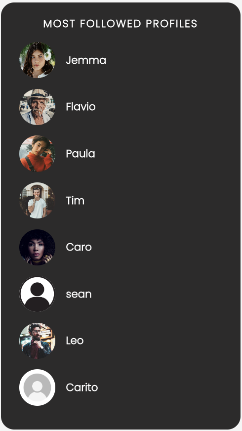

INSTANTES - An interactive image sharing app
==================================

* * *

ABOUT THE WEBSITE:
------------------

* * * 

[Link to deployed site](https://for-the-love-of-food1.herokuapp.com/)

_Instantes_ is a public online blog-styled media platford where users can create a profile and post their images along with a title and content. Users can also view other users profiles, comment, like and favourite them! This interactive platform is designed to provide a a rich online community as users interact with each others posts.

* * * 

## TARGET AUDIENCE:

* * *

This platform targets pree-teens, teenagers and adults. Anyone who wants to can create a profile can post images and content and connect with others! From grandma posting cute cat pics, to professional photographers.. everyone can find their place in Instantes. The search feature allows for people to find content they are interested on, follow the profiles and even bookmark the posts.

*   Children 13+ (who are allowed to be on social media)
*   Adults

  
* * *

USER STORIES:
-------------

* * *
Navigation & Authentication
1. Navigation: As a user I can view the navbar from every page so that I can navigate between pages  easily.
2. Routing: As a user I can navigate through pages quickly and easily so that I can view the content without having to refresh the page.
3. Authentication - Sign up: As a user I can create a profile so that I can access all the features available for signed up users.
4. Authentication - Sign in: As a user I can sign in to the app so that I can access all the functionality available for logged in users.
5. Authentication - Logged in Status: As a user can easily tell if I am logged in or not.
6. Authentication - Refreshing access tokens: As a user I am able to remain logged in until I decide to log-out so that my experience as a user is enjoyable.
7. Navigation: Conditional rendering - As a logged out user I can clearly see sign in and sign up options so that I can easily sign in or sign up if I want to.
8. Avatar: As a user I can view user's  images so that I can easily identify each user.

Adding, Liking and bookmarking Posts
9. Create posts: As a logged in user I can create posts so that I can share my images with anyone who has access to this app.
10. View a post: As a user I can view the details of a post so that I can know more about it.
11. Like a post: As a logged in user I can manually like a post so that I can show the comunity what I like.
12. Bookmark a post: As a logged in user I can manually bookmark a post so that I can save what I like what I like.

The Posts Page
1. View most recent posts: As a user I can posts ordered by most recently created first, so that I don't miss any new content.
2. As a user, I can search for posts using keywords, so that I can find the content I am most interested in.
3. View bookmarked posts: As a logged in user save posts I liked so that I can easily view them again and again!
4. View posts of followed users: As a logged in user I can follow users so I can filter the content I view and keep up with their posting.
5. Infinite scroll: As a user I can infinately scroll through posts, so that I don't have to click on "next page" etc

The Post Page
1. Post page: As a user I can view individual posts page so that I can read the post comments.
2. Edit post: As a post owner I can edit my post title, content and image so that I can correct or change my post once created.
3. Create a comment: As a logged in user I can comment a post so that I can express my opinions it and interact with people.
4. Comment date: As a user I can see how long ago a comment was made so that I know when this was written.
5. View comments: As a user I can view post comments so that I can see what others think about this post.
6. Delete comments: As the owner of a comment I can delete my comment so that I have control over my discussions in the forum.
7. Edit a comment: As the owner of a comment I can edit my comment so that I update it if wanted.
8. Most popular posts: As a user I can see a list of the most liked posts so that I can see which ones are the most popular ones.

The Profile Page
1. Profile page: As a user I can view other users profiles so that I can view their content and potentially intercat with them.
2. Most followed profiles: As a user I can see a list of the most followed profiles so that I can see which ones are the most popular ones.
3. User profile - user stats: As a user I can view the stats about a user including bio, number of posts, follows, bookmarks and users followed so that I can know more about the profile.
4. Follow/Unfollow a user: As a logged in user I can follow or unfollow users so that I can filter the posts I want in my feed.
5. View all posts by a specific user: As a user I can view all the posts created by one specific user so that I can view their content and see if I would like to follow them or not.
6. Edit profile: As a logged in user I can edit my profile so that I can update and change it when I like, to best express myself.
7. Update username and password: As a logged in user I can update my username and password so that I can change my display name whenever I like and always keep my profile safe.

* * * 

STRATEGY:
---------

* * *

Create an aesthetically pleasing, simple yet fast  open source user interface content sharing app that is easy to navigate. The site allows users to create their profile (including avatar, username and bio), and upload their own content including photos, titles and decriptions. Users can also view and interact with other users posts: liking, commenting and saving as favourites. Their favourites will all be displayed in their favourites page.

The site will allow for user authentification, and basic CRUD functionality.

The goal is to create a code that is clear and allows you to update with ease. 

* * * 

STRUCTURE:
----------

* * *

### Initial Home Page

* * *

*   LANDING PAGE: This is the page that initially loads when you first arrive at the site. Without logging in....
    * Navbar: Header title "Instantes", Home, Sign In and SignUp links (containing font awesome icons).
    * Posts rendered by all users
    * Search bar where you can search posts by relevant keyword.
    * List of most followed profiles
    * List of most liked posts
*   LANDING PAGE: Once logged in....
    * Only difference is in the Navbar: App name, AddPost, Home, Feed, Liked, Favourite, Sign Out, and Profile link and avatar.

* * * 

### Sign In Page 

* * *

When user clicks a on Sign In link on navbar:

* NavBar displays: App title, Home, Sign In (is styled differently to stand out.), and Sign Up link 
* Sign In form containing the following:
    * Form title: Sign In.
    * Username
    * Password
    * Sign in Button
    * Link below to Sign Up (in case user has not created a profile yet!)
* Image by the form. This image disappears when using smaller mobile screens.

### Sign Up Page 

* * *

When user clicks a on Sign Up link on navbar:

* NavBar displays: App title, Home, Sign In, and Sign Up (is styled differently to stand out.)link .
* Sign Up form containing the following:
    * Form title: Sign Up.
    * Username
    * Password
    * Confirm password
    * Sign Up Button
    * Link below to Sign Up (in case user already has an account!)
* Image by the form. This image disappears when using smaller mobile screens.

### Feed Page 

* * *

When the logged in user clicks a on the Feed link on navbar:

* NavBar displays with logged in icons as previous: Feed link is styled differently to stand out.
* Search field.
* Listed posts rendered below. Please note these are the posts of followed user only! Each post displays:
    * Post author with avatar by it.
    * Date of post
    * Image
    * Image title
    * Image description content
    * Links: Like button and count, Bookmark button and count, and Comment fontaweson icon and count
* List of most followed users
* List of most liked posts

* * * 

### Individual Post Page

* * *

When user clicks on any Post, the user can view the individual post page which contains...

* NavBar displays with logged in icons/logged out icons. 
* individual post which displays:
    * Post author with avatar by it.
    * Date of post
    * Image
    * Image title
    * Image description content
    * Links: Like button and count, Bookmark button and count, and Comment fontawesome icon and count
    * Comment sections (if user is logged in they have the option to comment. If they are not, they can only view the comments.)
* List of most followed users
* List of most liked posts

Logged in

Logged out

  

* * * 

### Add Post Page

* * *

When logged in user clicks on Add Post in the NavBar, the user can view...

* NavBar displays with logged in icons as previous. Create Post link is larger and underlined.
* Create Post Form including the following fields:
    * Image user can click on to upload image.
    * Title input field
    * Description field
    * Create button
    * Cancel button

* * * 

### Edit Post Page

* * *

When logged in user clicks on three dots above their own post and the edit symbol, the user can view...

* NavBar displays with logged in icons as previous.
* Create Post Form including the following fields with default content:
    * Image user can click on button below to upload new image.
    * Title input field
    * Description field
    * Save button
    * Cancel button

* * * 

### Liked Page 

* * *

When clicking liked, the user can view all their liked posts. The layout of the page is the same as the home page and the feed page. Only difference is this will display the users liked posts only!

* * * 

### Bookmarks Page 

* * *

When clicking bookmarks, the user can view all their favourite bookmarked posts. The layout of the page is the same as the home page and the feed page. Only difference is this will display the users bookmarked posts only!

* * * 

### Profile Page

* * *

When logged in user clicks on Profile in the NavBar, the user can view...

* NavBar displays with logged in icons as previous.
* User profile details:
    * Username
    * Avatar
    * Posts Count
    * Followers Count
    * Following Count
    * 3 dots dropdown with option to edit profile, change username, change password (and in future delete profile).
* Listed posts of logged in user rendered below. Each post displays the usual:
    * Post author with avatar by it.
    * Date of post
    * Image
    * Image title
    * Image description content
    * Links: Like button and count, Bookmark button and count, and Comment fontaweson icon and count
    * An extra 3 dot dropdown menu to edit or delete the post.
* List of most followed users
* List of most liked posts

* * * 
  
### Edit Profile Page

* * *

When logged in user clicks on the edit icon in 3 dots dropdown in Profile Page, the user can view...

* NavBar displays with logged in icons as previous.
* Update Profile Form including the following:
    * Current avatar.
    * Change the image button that user can click to upload new avatar
    * Bio text input field
    * Save button
    * Cancel button
    * In future: delete post!

  
### Edit Username Page

* * *

When logged in user clicks on the edit icon in 3 dots dropdown in Profile Page, and change username, the user can view...

* NavBar displays with logged in icons as previous.
* Edit usernmae:
    * Subtite
    * Current username as default, which can be edited
    * Save button
    * Cancel button 
    
    

* * * 

### Edit Password Page

* * *

When logged in user clicks on the edit icon in 3 dots dropdown in Profile Page, and change password, the user can view...

* NavBar displays with logged in icons as previous.
* Edit usernmae:
    * Subtite
    * New password input field
    * Confirm new password input field
    * Save button
    * Cancel button 
    
    
 

## SKELETON:

-----------

### WIREFRAMES:

* * * 

## THE CODE:

* * *
Prior to commencing to write my code out, I planned out the ERD.

You can find a link to a more in depth database Backend ReadMe HERE.

The User Model ---> Django default User Model. We will use user (PK), Email and Password.

Recipe Model --> Is our main model. It contains all the required fields for our recipe: recipe_id(PK), title, category(FK), slug, author(FK-User), created_on, image, ingredients, directions, likes, favourites, status and user. 

Categories Model --> Containing the categories_id(PK), category field.

Comments Model --> Containing, comment_id(PK), User(FK), recipe_id, body, created_on.

Favourites Model --> Contains favourtites_id, recipe_id, user, likes.

IMPORTANT RELATIONSHIPS BETWEEN TABLES:
* One to many relationship between the User and the Recipe model.
* One to many relationship between the User and the Favouries model.
* One to many relationship between the User and the Comments model.
* One to many relartionships between Category and Recipe's.
* One to many relationships between Recipe and Comments model.

* * * 

## SURFACE

* * *

* My initial wireframes...

* * *

### Colors

* * *

* When initially planning this site, I knew I wanted more of a masculine style calling for a deep, rich colour scheme. 
* This would allow for the images to really pop in the app.

* * * 

### Typography

* * *

Light, spaced, masculine and clean font. 
*  Poppins
*  Use of letter-spacing
*  Use of uppercase

### Images and Icons

* * *

Use of a few font-awesome icons for:
* NavBar links
* Like, Bookmark, and comment buttons.
* Dropdown menu for editing/deleting posts
* Dropdown meny for editing profile

Default avatar profile image: which is automatically uploaded when profile is created.

Vectors used for:
* Search feature: when something is not found (page, searched item, or no posts)
* Upload item

Hexedecimal icon for the search bar.

A couple images for our Sign In and Sign Up pages: create the mood of the site. I purposefully picked images that go with the color scheme of the site: dark, deep, masculine colors.

* * * 

FEATURES:
---------

* * *

### Initial Home Page

* * *

*   LANDING PAGE: Without logging in....
    * Navbar: Header title "Instantes", Home, Sign In and SignUp links (containing font awesome icons).
    
    * Posts rendered by all users
    * Search bar where you can search posts by relevant keyword.
    
    * List of most followed profiles

    
    
    And in mobile view....

    

    * List of most liked posts

    
    
    And in mobile view...

    

*   LANDING PAGE: Once logged in....
    * Only difference is in the Navbar: App name, AddPost, Home, Feed, Liked, Favourite, Sign Out, and Profile link and avatar.
    

* * * 

### Individual Post Page

* * *

When user clicks on any Post, the user can view the individual post page which contains...

* NavBar displays with logged in icons/logged out icons. 

* individual post which displays:
    * Post author with avatar by it.
    * Date of post 
    * Image
    * Image title
    * Image description content
    * Links: Like button and count, Bookmark button and count, and Comment fontawesome icon and count 

Comment section containing:

If user logged in....
* Avatar
* Input field to add comment 
* POST button to submit form
* Comments displayed below (from most recent)

If not logged in - no form is present! Only Comments subtitle displayed

Comments displayed below containing...
* Avatar
* Username
* How long ago it was posted
* If logged in user made this comment: three dots (to allow for edit or deleting comment)
* The comment

If clicking edit comment symbol, the following is displayed:
* Avatar
* Username
* Input field with default comment
* Cancel button
* Save button

  

* * * 

### Sign In Page 

* * *

When user clicks a on Sign In link on navbar:

* NavBar displays: App title, Home, Sign In (is in larger font and underlined), and Sign Up link 

    

* Sign In form containing the following:
    * Form title: Sign In.
    * Username
    * Password
    * Sign in Button
    * Link below to Sign Up (in case user has not created a profile yet!)

    

    

* Image by the form. This image disappears when using smaller mobile screens.

    

### Sign Up Page 

* * *

When user clicks a on Sign Up link on navbar:

* NavBar displays: App title, Home, Sign In, and Sign Up (is in larger font and underlined)link .

* Sign Up form containing the following:
    * Form title: Sign Up.
    * Username
    * Password
    * Confirm password
    * Sign Up Button
    * Link below to Sign Up (in case user already has an account!)

* Image by the form. This image disappears when using smaller mobile screens.

### Feed Page 

* * *

When the logged in user clicks a on the Feed link on navbar:

* NavBar displays with logged in icons as previous: Feed link differently styled so as to stand out.

* Search field.

* Listed posts rendered below. Please note these are the posts of followed user only! Each post displays:
    * Post author with avatar by it.
    * Date of post
    * Image
    * Image title
    * Image description content
    * Links: Like button and count, Bookmark button and count, and Comment fontaweson icon and count

    

* List of most followed profiles

    
    
    And in mobile view....

    

    * List of most liked posts

    
    
    And in mobile view...

    

* * * 
  
### Bookmarked Page 

* * *

When the logged in user clicks a on the Bookmark link on navbar:

* NavBar displays with logged in icons as previous: Feed link differently styled so as to stand out.

* Search field.

* Listed posts rendered below. Please note these are the posts of bookmarked posts only! Each post displays:
    * Post author with avatar by it.
    * Date of post
    * Image
    * Image title
    * Image description content
    * Links: Like button and count, Bookmark button and count, and Comment fontaweson icon and count

    

* List of most followed profiles

    
    
    And in mobile view....

    

    * List of most liked posts

    
    
    And in mobile view...

    

* * * 

### Profile Page

* * *

When logged in user clicks on Profile in the NavBar, the user can view...

* NavBar displays with logged in icons as previous.

* User profile details:
    * Username
    * Avatar
    * Posts Count
    * Followers Count
    * Following Count
    * 3 dots dropdown with option to edit profile, change username, change password, and delete profile????????!!!!!!!!!!!!!%$&*&^£@)
    * Subtitle: Owner's posts

* Listed posts of logged in user rendered below. Each post displays the usual:
    * Post author with avatar by it.
    * Date of post
    * Image
    * Image title
    * Image description content
    * Links: Like button and count, Bookmark button and count, and Comment fontaweson icon and count
    * An extra 3 dot dropdown menu to edit or delete the post.

* List of most followed profiles

    
    
    And in mobile view....

    

* List of most liked posts

    
    
    And in mobile view...

    

### Add Post Page

* * *

When logged in user clicks on Add Post in the NavBar, the user can view...

* NavBar displays with logged in icons as previous. Create Post link is styled differently to stand out.

* Create Post Form including the following fields:
    * Image user can click on to upload image.
    * Title input field
    * Description field
    * Create button
    * Cancel button

* * * 

### Edit Post Page

* * *

When logged in user clicks on three dots above their own post, and the edit symbol, the user can view...

* NavBar displays with logged in icons as previous.

* Create Post Form including the following fields with default content:
    * Default Image     
    * Button user can click onto upload new image.
    * Title input field with default text
    * Description field with default text
    * Save button
    * Cancel button

* * * 

### Edit Profile Page

* * *

When logged in user clicks on the edit icon in 3 dots dropdown in Profile Page, and edit profile, the user can view...

* NavBar displays with logged in icons as previous.

* Update Profile Form including the following:
    * Current avatar.
    * Change the image button that user can click to upload new avatar.  
    * Bio text input field
    * Save button
    * Cancel button 
  
* * * 

### Edit Username Page

* * *

When logged in user clicks on the edit icon in 3 dots dropdown in Profile Page, and change username, the user can view...

* NavBar displays with logged in icons as previous.

* Edit usernmae:
    * Subtite
    * Current username as default, which can be edited
    * Save button
    * Cancel button 
    
    

* * * 

### Edit Password Page

* * *

When logged in user clicks on the edit icon in 3 dots dropdown in Profile Page, and change password, the user can view...

* NavBar displays with logged in icons as previous.

* Edit usernmae:
    * Subtite
    * New password input field
    * Confirm new password input field
    * Save button
    * Cancel button 
    
    
  

### Future features

* Allow for videos to be posted, as well as images.
* Most popular posts: allow the like button to be functional (like/unlike), and when clicking the post it will redirect you to the post withing theuse profile. This will allow to see the rets of their work if interested!
* Infinite scroll for profiles box
* Auto-refresh DOM when liking/bookamrking etc. At the moment we have to refresh the page for changes to display.

* * * 

## LANGUAGES:

* * *

*   PYTHON
*   CSS
*   HTML
*   JavaScript

* * * 

## OTHER TECHNOLOGIES, FRAMEWORKS & LIBRARIES:

* * *

*   [REACT](https://reactjs.org/)
*   [REACT-Bootstrap](https://react-bootstrap-v4.netlify.app/)
*   [Django](https://www.djangoproject.com/)
*   [GitHub](https://github.com/)
*   [GitPod](https://www.gitpod.io/)
*   [Heroku](https://id.heroku.com/login)
*   [Stack Overflow](https://stackoverflow.com/)
*   [Code beautify](https://codebeautify.org/html-to-markdown)
*   [Balsamiq](https://balsamiq.com/wireframes/desktop/#)
*   [Pep8](http://pep8online.com/)
*   [Cloudinary](https://cloudinary.com/)
*   [PostgreSQL](https://www.postgresql.org/)
*   [Bootstrap](https://getbootstrap.com/)

* * * 

## TESTING, BUGS & FIXES:

* * *

For testing I used the following sources:

* * * 

### Tests

* * *

#### [Pep8](http://pep8online.com/)

Tested and no errors found.

urls.py

forms.py

admin.py

apps.py

views.py

models.py

tests.py

asgi.py

settings.py

A couple of long lines, but I am unable to make them any shorter.
urls.py

wsgi.py

#### [HTML VALIDATOR](https://validator.w3.org/)

Tested and no errors found!

This was easily solved by changing my alt value to -Image of recipe.

#### [CSS VALIDATOR](https://jigsaw.w3.org/css-validator/)

style.css
NO ERRORS FOUND!

summernote.css
NO ERRORS FOUND!

* * *

#### Manual testing 

* * * 

Testing this site manually was a long and very detailed process. No errors were found.

* * *

HOMEPAGE:

* * *

- Loads properly. No errors or broken links.

- When clicking the fontawesome button (knife and fork), home(in navbar) or the site title (For the Love of Food) link works and we get redirected to the homepage. This works from any part of the site!

- When clicking on Register (in our navbar), or sign up link (in our login page), the link works correctly and re-directs us to the signup.html page.

- When clicking on Login (in our navbar), or Sign In link (in our Register page), the link works correctly and re-directs us to the login.html page.

- Recipes are displayed in lists, three per row. Unless viewing from a smaller device.  In this case, they are below each other.

- When clicking on any recipe (without being logged in), we are directed to the recipe_detail.html. User can view all the details, amount of likes, favourites and comments. They can view the comments. They CANNOT comment.

* * *

SIGNUP:

* * *

- Signup cannot be submitted without enterring username or password. Email is optional!

- Once registering, the user is immediately logged in, and an alert comes up displaying who has logged in. The alert disappears after 3 seconds.

* * *

LOGIN...

* * *

-  User cannot login withourt compleying the form correctly. Username and password (both case sensitive).

- Once logged on, the site user can view the following on the nav bar:

- if not logged in, the user can only view...

* * *

FROM LOGGED IN USER ...

* * *

- When clicking on any recipe (oncelogged in), we are directed to the recipe_detail.html. User can view all the details, amount of likes, favourites and comments. They can view the comments. Here they have the ability to:
    * Comment on a post
    
    
    
    

    * Like a post

    * Favourite a post
    

    * Form cannot be submitted without entering to body field.
    
    

- When clicking on Create Recipe button in top right corner, the user is directed to create_recipe.html page that requires a form to be submitted.
    * Summernote is displayed in the text field for Ingredients, and Directions. The default font is Monserrat, 14px and font weight 200.

    
    
    

    * All fields are required to submit. form except for: Image and Status 
    
    
    
    
    
    BUG! I would like this alert to be displayed on every field that is. required. I. noticed this is not the case with the Directions field or the title.

    * When clicking Create Recipe, the user is redirected to the homepage. If no image was uploadedm a default is presented. (as in SC example)

    

    * If the user created the recipe, they can edit it. If they did not create the recipe, this option is not available. SC had a edit fontawesome icon. Teriyaki and potato sides do not! 

     

- When clicking on the Edit icon on the recipe (that is available only if the user created this specific recipe), the user is redirected to the edit_recipe.html page. This is very similar to the create_recipe.html. In this case the fields are pre-populated. 

There is an extra feature = DELETE RECIPE!  It is in a bright red button, so as to warn the user of teh severity of this button's functinality.

When changing the details and clicking Update Recipe button, the use ris redirected to the home page. The Recipe is updated!!

- When clicking Favourites on navbar, the user is redirected to the favourites page. This renders only the recipes that our user has favourited. They are displayed similar to the homepage. Recipes that have been favourited by other users... these will NOT be displayed.

- When clicking Drafts on navbar, the user is redirected to the drafts page. This renders only the recipes written by the user, who's status is draft. They are displayed similar to the homepage. Other users drafts will NOT be displayed here. 

* * *

DELETE

* * *

- When clicking Delete Recipe at the bottom of the edit_recipe.html, the user is redirected to the delete_recipe.html page. This is as a means of security. It asks for the user to confirm wether they are sure they want to delete this file.

* * *

LOG OUT

* * *

- When clicking on Logout (in our navbar), the link works correctly and re-directs us to the logout.html page. For security, this asks the user if they are sure they want to log out? If they click Logout, they are succesully redirected to the Homepage where limited features are displayed again.

USER AUTHENTIFICATION PROTECTION

* * *

- Added code to ensure the correct user is logged in to access certain urls. If not verified, the following message appears

* * * 

DJANGO ADMINISTRATOR

* * *

- From the backend, the administrator can create, edit and delete any Recipes, Comments, Categories. They can delete users. When making a change to any of these, the results are immediately visible in the front end of the site.

* * * 

###### BUGS & FIXES: 

UNABLE TO SIGN IN/SIGN UP FROM MOBILE DEVICE:
I couldn;t figure out why this was. After speaking to Code Institute tutors, they explained it's a common issue with Apple devices. To resolve it:
1. Go to settings in safari
2. Privacy and security 
3. Disable'Prevent Cross-Site Tracking' 

* * * 

#### Unresolved bug 

* * * 

* The would like to find a solution to the mobile device Sign In/Sign Out bug.
* The like/unike button in the Most liked posts is still not fully functioning. With a bit more time, I positive I will be able to make this work.

* * * 

#### Testing User Stories 

* * * 

NAVIGATION & AUTHENTICATION
1. Navigation: As a user I can view the navbar from every page so that I can navigate between pages  easily.

Yes - the navbar is displayed clearly across all pages and on all screens. When on mobile devices, the dropdown menu button is clear and the dropdown icons are easily accessible.

2. Routing: As a user I can navigate through pages quickly and easily so that I can view the content without having to refresh the page.

Yes - as a user I can navigate eaisly without having to refresh the page. The only thing I haven't been able to resolve, is the instant update of feed when bookmarking or liking. It required refreshing the DOM to fully display all new data.

%^&*()*&^%$*(*&^%$^&*)

3. Authentication - Sign up: As a user I can create a profile so that I can access all the features available for signed up users.

Yes - users can create their own profile and access all features.

4. Authentication - Sign in: As a user I can sign in to the app so that I can access all the functionality available for logged in users.

Yes - users can then sign in to the app to access all functionality available for logged in users.

5. Authentication - Logged in Status: As a user can easily tell if I am logged in or not.

Yes - the navbar clearly displays wether the user is logged in or not. When logged in, the user has extra features and can view their own avatar and username.

6. Authentication - Refreshing access tokens: As a user I am able to remain logged in until I decide to log-out so that my experience as a user is enjoyable.

Yes - users can remain logged in until they log out.

7. Navigation: Conditional rendering - As a logged out user I can clearly see sign in and sign up options so that I can easily sign in or sign up if I want to.

Yes - the navbar and conditional rendering of navbar icons allows the user to easily know wether they are logged in or not. If logged out: sign in and sign up options are available. if logged in, all features available in navbar.

8. Avatar: As a user I can view user's  images so that I can easily identify each user.

Yes - users can view the profiles avatar. This would be the images the user selected, or the default avatar.

ADDING, LIKING AND BOOKMARKING POSTS:
9. Create posts: As a logged in user I can create posts so that I can share my images with anyone who has access to this app.

Yes - logged in users can create their own posts, as many as they like!

10. View a post: As a user I can view the details of a post so that I can know more about it.

Yes - all users can view all details about every post: likes, bookmarks, comments, title, content, image, owner.

11. Like a post: As a logged in user I can manually like a post so that I can show the comunity what I like.

Yes - logged in users can like a post by clicking on the heart icon below the post!

12. Bookmark a post: As a logged in user I can manually bookmark a post so that I can save what I like what I like.

Yes - logged in users can bookmark a post by clicking on the bookmark icon below the post!

THE POSTS PAGE:
1. View most recent posts: As a user I can view posts ordered by most recently created first, so that I don't miss any new content.

Yes - users can view all posts, and they are ordered by most recent.

2. As a user, I can search for posts using keywords, so that I can find the content I am most interested in.

Yes - users can input a searchword and the related posts will pop up. if not posts match the keyword, then "No matches found" message will appear.

3. View bookmarked posts: As a logged in user save posts I liked so that I can easily view them again and again!

Yes - logged in users will be able to view all bookmarked posts under the bookmarks tab.

4. View posts of followed users: As a logged in user I can follow users so I can filter the content I view and keep up with their posting.

Yes - logged in users may view the posts of their followed profiles, when clicking on FEED.

5. Infinite scroll: As a user I can infinately scroll through posts, so that I don't have to click on "next page" etc

Yes - users (logged-in and logged-out) can view posts by scrolling down, withoiut having to refresh or change the page.

The Post Page
1. Post page: As a user I can view individual posts page so that I can read the post comments.
2. Edit post: As a post owner I can edit my post title, content and image so that I can correct or change my post once created.
3. Create a comment: As a logged in user I can comment a post so that I can express my opinions it and interact with people.
4. Comment date: As a user I can see how long ago a comment was made so that I know when this was written.
5. View comments: As a user I can view post comments so that I can see what others think about this post.
6. Delete comments: As the owner of a comment I can delete my comment so that I have control over my discussions in the forum.
7. Edit a comment: As the owner of a comment I can edit my comment so that I update it if wanted.
8. Most popular posts: As a user I can see a list of the most liked posts so that I can see which ones are the most popular ones.

The Profile Page
1. Profile page: As a user I can view other users profiles so that I can view their content and potentially intercat with them.

Yes - users can easily view other peoples profiles by clicking on the user avatar. 

2. Most followed profiles: As a user I can see a list of the most followed profiles so that I can see which ones are the most popular ones.

Yes - users (logged in and logged out) can view most followed profiles eaisly. This is displayed on most feed/content pages.

3. User profile - user stats: As a user I can view the stats about a user including bio, number of posts, follows, bookmarks and users followed so that I can know more about the profile.

Yes - users can eaisly view other people and their own stats. This is displayed in the user profile- and is visible to logged in and logged out users.

4. Follow/Unfollow a user: As a logged in user I can follow or unfollow users so that I can filter the posts I want in my feed.

Yes - all logged in users can choose to follow/unfollow another profile at any time. This is easily done by clicking the follow/unfollow button.

5. View all posts by a specific user: As a user I can view all the posts created by one specific user so that I can view their content and see if I would like to follow them or not.

Yes - as user I can view another users content eaisly by clicking on their profile. This displays their stats, as well as all of their posts!

6. Edit profile: As a logged in user I can edit my profile so that I can update and change it when I like, to best express myself.

Yes - as a logged in user, I can eaisly update my profile as I please. I can update: username, password, bio and avatar.

7. Update username and password: As a logged in user I can update my username and password so that I can change my display name whenever I like and always keep my profile safe.

Yes - as a logged in user, I can do this at any time. Simply click on profile, three dots, and update username or update password.

* * *

## DEPLOYMENT:

* * *

### Forking The GitHub Repository

* * *

You can Fork the Repository. This makes a copy of the original repository on our Github account so you can make changes without affecting the original repository.
1. Log into GitHub and locate the GitHub repository you want.
2. Click on the "Fork" button which is located in the top right corner.
3. You will now have a copy of the original repository in your GitHub account.

* * * 

### Cloning the Project.
* * *
1. Log into GitHub and locate the GitHub repository you want.
2. Under the repository name, click "Code" button which will come up with a dropdown menu.
3. Where it says Clone, copy the link below.

* * * 

### SETTING UP DJANGO PROJECT & DEPLOYMENT

* * *
#### SETTING UP THE DJANGO PROJECT...

_In GITHUB:_

 Once the repository has been created using the Code Institute student template....

1. Install Django and supporting libraries. 
    * Django and gunicorn --> pip3 install 'django<4' gunicorn
    * Supporting libraries --> pip3 install dj_database_url psycopg2
    * Cloudinary libraries --> pip3 install dj3-cloudinary-storage

2. Create a requirements file --> pip3 freeze --local > requirements.txt

3. Create your project: in this case for-the-love-of-food

4. Create an app using command --> python3 manage.py startapp APP_NAME

5. Add it to installed apps --> INSTALLED_APPS = [
    …
    'APP_NAME',
]

6. Save file and migrate changes using command --> python3 manage.py migrate

7. Run server to test

8. Commit and push changes to github

#### DEPLOYING THE APP TO HEROKU...

1. Create Heroku Account
2. In Heroku dashboard: go to Create new app.
3. Give your app a unique name.
4. Select region --> EUROPE
5. Click create App.
6. Go to Database App/Resources/ Add-ons and search and click 'Heroku Postgres'.
7. Go to the Settings tab, scroll down to Config Vars and select Reveal Config Vars and copy text.

_IN GITPOD..._

8. Create env.py file on top of level directory.
9. Import os library
10. set environment variables --> os.environ["DATABASE_URL"] = "Paste in Heroku DATABASE_URL Link"
11. Add in a secret key --> os.environ["SECRET_KEY"] = "Make up your own randomSecretKey"

_IN HEROKU ..._

12. Add secret Key to config vars --> SECRET_KEY, “randomSecretKey”

_IN GITPOD / IN SETTINGS.PY_

13. Reference env.py file -->
import os
import dj_database_url

if os.path.isfile("env.py"):
   import env

14. Remove the secret key and replace it with the following variable--> SECRET_KEY = os.environ.get('SECRET_KEY')

15. Comment out the DataBases section -->
 DATABASES = {
     'default': {
         'ENGINE': 'django.db.backends.sqlite3',
         'NAME': BASE_DIR / 'db.sqlite3',
     }
 }

 16. Add new database section -->
 DATABASES = {
   'default': dj_database_url.parse(os.environ.get("DATABASE_URL"))
}

17. In the terminal, save files and make migrations --> python3 manage.py migrate

_GETTING STATIC AND MEDIA FILES STORED ON CLOUDINARY..._

18. Create a cloudinary account, and copy the CLOUDINARY_URL from the dashboard.

19. Add url to env.py -->
os.environ["CLOUDINARY_URL"] = "cloudinary://************************"

_BACK IN HEROKU ..._

20. Paste Cloudinary URL to Heroku Config Vars -->
Add to Settings tab in Config Vars e.g. COUDINARY_URL, cloudinary://************************

21. In config vars, add DISABLE_COLLECTSTATIC, 1. This will be rmeoved before final deployment.

_IN GITPOD / SETTINGS.PY_

22. Install Cloudinary libraries -->
INSTALLED_APPS = [
    …,
    'cloudinary_storage',
    'cloudinary',
    …,
]

23. Tell Django to use Cloudinary to store media and static files -->
STATIC_URL = '/static/'

STATICFILES_STORAGE = 'cloudinary_storage.storage.StaticHashedCloudinaryStorage'
STATICFILES_DIRS = [os.path.join(BASE_DIR, 'static')]
STATIC_ROOT = os.path.join(BASE_DIR, 'staticfiles')

MEDIA_URL = '/media/'
DEFAULT_FILE_STORAGE = 'cloudinary_storage.storage.MediaCloudinaryStorage'

23. Link file to templates -->
TEMPLATES_DIR = os.path.join(BASE_DIR, 'templates')

24. Change template directory to templates array -->
TEMPLATES = [
    {
        …,
        'DIRS': [TEMPLATES_DIR],
       …,
            ],
        },
    },
]

25. Add heroku hostname to ALLOWED_HOSTS-->
ALLOWED_HOSTS = ["PROJ_NAME.herokuapp.com", "localhost"]

_IN GITPOD..._

26. Create 3 new folders: media, static and templates

27. Create procfile and add code -->
web: gunicorn PROJ_NAME.wsgi

28. In terminal --> Add, Commit and Push

_IN HEROKU ..._

29. Deploy manually -->  Github as deployment method, on main branch

#### FINAL PRODUCTION DEPLOYMENT..

_IN GITPOD / SETTINGS.PY_

1. Set DEBUG flag to False!! If not...
    * Django will serve the static  files such as css files itself, instead of relying on Cloudinary.
    * Django will continue to give us verbose error pages which can reveal credentials, and things you want to keeo secret. This will compromise your site!
2. Add a few more settings--> X_FRAME_OPTIONS = 'SAMEORIGIN'
    * Without this our summer note editor would no  longer work when we deploy the project. This is due to Cross-Origin Resource Sharing, which tells the browser which resources are permitted to be loaded.
3. Save, add and commit as "deployment commit", and push to github.

_IN HEROKU..._

4. In reveal config vars, remove DISABLE_COLLECTSTATIC environment variable.

5. Go to deploy tab, scroll down to the end and deplopy our branch! 

6. Your app has been deployed to heroku!

### Forking The GitHub Repository

* * *

You can Fork the Repository. This makes a copy of the original repository on our Github account so you can make changes without affecting the original repository.
1. Log into GitHub and locate the GitHub repository you want.
2. Click on the "Fork" button which is located in the top right corner.
3. You will now have a copy of the original repository in your GitHub account.

* * * 

### Cloning the Project.
* * *
1. Log into GitHub and locate the GitHub repository you want.
2. Under the repository name, click "Code" button which will come up with a dropdown menu.
3. Where it says Clone, copy the link below.

* * * 

[Link to deployed site](https://for-the-love-of-food1.herokuapp.com/)

* * *

CREDITS: 
--------

* * *

### Content & Code

This project was extremely challengin for me. I used several resources to get me to the finish line, as well as the help of tutors, my mentor and fellow students at Code Institute.

* I used the "I think therefore I blog" walk through project as a starting point and template. As per this walktrhiugh projects, I created a blog like page that stored recipes. I used some snippets of code as reference, and nbuilt upon it with more features. (Such as favourites view, create recipe view, edit and delete, and drafts view).
* Oisin (tutor) in Code Institute helped me troubleshoot some issues I was having with my cloudinary images not loading onto my site. 
* Alan (tutor) in Code Institute helped me troubleshoot some issues I was having with fontawesome icons. Thanks!
* Sean (tutor) at Code Instutute helped me troubleshoot an error I was getting when connecting my urls for creating a recipe.
* Matt (a former Code Instutute student) helped me toroubleshoot an issue I was having with displaying summernotes from the front end, and my cloudinary image not updating wehen editing my form. Thank you Matt!!!
* Chris (my mentor) helped me plan out the project and supported me every step of the way.
* Codemy.com --> I followed a few tutorials to get ideas as how to create/edit/delete my recipe blog posts. https://www.youtube.com/watch?v=J7xaESAddDQ

       

